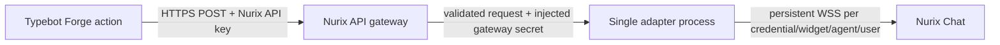

# Nurix Typebot Adapter

An HTTP-to-WebSocket bridge that lets a Typebot Forge action exchange messages with Nurix Chat while a server-side process keeps the Nurix WebSocket alive between Typebot turns.

The Typebot block itself remains request-scoped. This adapter owns connection reuse, application-level ping/pong, FIFO message dispatch, timeouts, reconnects, and idempotency.

> [!IMPORTANT]
> This first version keeps sessions and idempotency records in memory and supports **exactly one running replica**. Do not autoscale it, run overlapping rolling deployments, or expect replay protection to survive a restart. Distributed socket ownership and durable idempotency are required before horizontal scaling.

## Architecture



The public gateway must terminate TLS, validate and rate-limit the Nurix bearer credential, strip any client-supplied `X-Adapter-Gateway-Secret`, and inject its own copy of that header on the private hop. The adapter refuses to start without a gateway secret except through an explicit loopback-only development bypass.

## API

The machine-readable contract is in [`openapi.yaml`](./openapi.yaml).

### Send a message

`POST /v1/messages`

Public request headers:

- `Authorization: Bearer <Nurix API key>`
- `Idempotency-Key: <stable key for this logical message>`
- `Content-Type: application/json`
- Optional `X-Request-Id` containing 1–128 safe ASCII characters

The internal gateway adds `X-Adapter-Gateway-Secret`; a Typebot block must never know or send this deployment secret.

```json
{
  "widgetId": "widget-id",
  "agentId": "agent-id",
  "userId": "stable-typebot-user-id",
  "message": "Where is my order?"
}
```

Successful response:

```json
{
  "content": "Your order is on the way.",
  "conversationId": "conversation-id",
  "messageId": "message-id"
}
```

A successful cached replay includes `Idempotency-Replayed: true`.

Error response:

```json
{
  "error": {
    "code": "NURIX_DELIVERY_UNKNOWN",
    "message": "The Nurix message delivery outcome is unknown and must not be retried automatically.",
    "safeToRetry": false,
    "requestId": "4f91d99e-5ca8-4b82-b7bb-ab27630d0654"
  }
}
```

Respect `safeToRetry`. In particular, never submit a new idempotency key after `NURIX_DELIVERY_UNKNOWN`: Nurix may have received the original message even though the adapter did not receive its response.

### Idempotency behavior

- Scope is the Nurix credential plus the supplied idempotency key.
- Concurrent identical requests join one operation.
- Successful and delivery-ambiguous outcomes are retained for `IDEMPOTENCY_TTL_MS`.
- Failures known to occur before dispatch are removed so the same key can be retried.
- Reusing a key with a different body returns `409 IDEMPOTENCY_CONFLICT`.
- Records are process-local and disappear on restart.

### Session behavior

- A session is keyed by an opaque HMAC of the Nurix API key, widget ID, agent ID, and user ID.
- Exactly one message is in flight per WebSocket because the documented Nurix request frame has no client correlation ID.
- Concurrent requests for one session wait in a bounded FIFO queue. A queued request that cannot dispatch within `QUEUE_TIMEOUT_MS` fails without being sent.
- Heartbeats continue between HTTP requests. Missing pong, malformed frames, response timeout, or unexpected socket loss poison and evict that socket.
- The adapter never automatically replays a message once WebSocket dispatch may have happened.
- Idle sessions close after `SESSION_IDLE_TIMEOUT_MS`.

The adapter ignores repeated responses with a previously observed `messageId`. Correct correlation still depends on Nurix guaranteeing exactly one ordered, non-welcome response per `response_required` request. If Nurix can send multiple distinct response frames for one request, the protocol must add a client correlation ID before this adapter is used in production.

Reconnect behavior also depends on Nurix confirming whether the same `user_id` resumes prior conversation state. Each response returns `conversationId` so callers can observe changes.

Unsolicited messages and human-handoff events cannot be injected into a paused Typebot flow by an ordinary Forge action; those require a separate Typebot resume/webhook design.

### Health

- `GET /health/live` returns `200` while the HTTP process is alive.
- `GET /health/ready` returns `200` while the instance accepts work and `503` during shutdown.

Health checks deliberately do not open a Nurix socket or fail during a Nurix outage. Connections are credential-specific and created lazily.

## Local development

Node.js 24 is required.

```sh
npm ci --ignore-scripts
npm run check
```

For an unauthenticated local loopback server only:

```sh
HOST=127.0.0.1 ALLOW_UNAUTHENTICATED_GATEWAY=true npm run build
HOST=127.0.0.1 ALLOW_UNAUTHENTICATED_GATEWAY=true npm start
```

PowerShell equivalent:

```powershell
$env:HOST = "127.0.0.1"
$env:ALLOW_UNAUTHENTICATED_GATEWAY = "true"
npm run build
npm start
```

In this development mode, call `http://127.0.0.1:3000/v1/messages` directly without the internal gateway header. Never combine the bypass with a non-loopback bind; configuration validation rejects it.

Tests use local fake WebSocket servers and never require a real Nurix key.

## Docker

Copy the example environment file and set a random 32-byte base64url gateway secret (43 characters without padding):

```sh
cp .env.example .env
docker compose up --build
```

Compose binds the adapter to localhost and applies a read-only filesystem, dropped Linux capabilities, and `no-new-privileges`. Put the private adapter port behind the Nurix-controlled gateway; do not publish it directly.

The default container grace period is 45 seconds. If `SHUTDOWN_TIMEOUT_MS` changes, set `CONTAINER_STOP_GRACE_PERIOD` to at least that deadline plus two seconds.

## Configuration

| Variable | Default | Purpose |
| --- | ---: | --- |
| `HOST` | `127.0.0.1` (`0.0.0.0` in the image) | HTTP bind address |
| `PORT` | `3000` | HTTP listen port outside Compose |
| `HOST_PORT` | `3000` | Host port used by Compose |
| `CONTAINER_PORT` | `3000` | Container listen and mapped port used by Compose |
| `GATEWAY_SHARED_SECRET` | required | 43–128 base64url characters; authenticates the private gateway hop |
| `ALLOW_UNAUTHENTICATED_GATEWAY` | `false` | Development-only bypass; accepted only with `NODE_ENV=development` and loopback `HOST` |
| `NURIX_WS_BASE_URL` | `wss://chat-in.nurixlabs.tech` | Nurix WebSocket origin; query strings and embedded credentials are rejected |
| `ALLOW_INSECURE_WS` | `false` | Allows `ws://` only outside production for local tests |
| `HANDSHAKE_TIMEOUT_MS` | `10000` | WebSocket connection deadline |
| `RESPONSE_TIMEOUT_MS` | `60000` | Response deadline after dispatch |
| `HEARTBEAT_INTERVAL_MS` | `25000` | Nurix application ping interval |
| `PONG_TIMEOUT_MS` | `10000` | Pong deadline after a ping |
| `SESSION_IDLE_TIMEOUT_MS` | `300000` | Idle session lifetime; heartbeats do not extend it |
| `MAX_PAYLOAD_BYTES` | `1048576` | Maximum inbound WebSocket frame size |
| `MAX_HTTP_BODY_BYTES` | `65536` | Maximum HTTP request body size |
| `MAX_MESSAGE_CHARACTERS` | `20000` | Maximum outbound message length |
| `MAX_RESPONSE_CHARACTERS` | `10000` | Maximum retained Nurix response content length |
| `MAX_SESSIONS` | `1000` | Process-wide live session cap |
| `MAX_QUEUE_DEPTH` | `10` | Waiting messages allowed behind one active session request |
| `QUEUE_TIMEOUT_MS` | `5000` | Maximum wait before an unsent queued message fails |
| `IDEMPOTENCY_TTL_MS` | `3600000` | Replay window after an operation settles |
| `MAX_IDEMPOTENCY_ENTRIES` | `5000` | Process-wide retained/pending idempotency cap; size it from expected hourly traffic and memory |
| `SHUTDOWN_TIMEOUT_MS` | `30000` | Maximum session drain period |
| `CONTAINER_STOP_GRACE_PERIOD` | `45s` | Compose stop deadline; must exceed shutdown timeout |

Reverse proxies should allow more than `HANDSHAKE_TIMEOUT_MS + RESPONSE_TIMEOUT_MS` for a request and must never log authorization headers, the internal gateway header, request bodies, full upstream WebSocket URLs, message text, or raw Nurix frames.

## Typebot integration

The Forge server action should POST to the public Nurix gateway, await the JSON response, and map `content`, `conversationId`, and `messageId` into Typebot variables. It should use a stable Typebot execution/message identifier as `Idempotency-Key`, not generate a new key on every retry.

```ts
const response = await fetch(`${nurixAdapterUrl}/v1/messages`, {
  method: "POST",
  headers: {
    Authorization: `Bearer ${credentials.apiKey}`,
    "Content-Type": "application/json",
    "Idempotency-Key": executionMessageId,
  },
  body: JSON.stringify({ widgetId, agentId, userId, message }),
});
```

The public gateway validates the bearer credential and adds the private gateway header before forwarding. Keep both credentials encrypted and out of client-side Forge code.

## Production roadmap

Before multiple replicas or zero-downtime rolling replacements:

1. Move idempotency outcomes to durable shared storage.
2. Route each session key to one actor/owner, or add consistent sticky ownership with leases.
3. Add per-tenant quotas and capacity metrics at the authenticated gateway.
4. Confirm the Nurix response cardinality, correlation, reconnect, and conversation-resumption guarantees.

## License

This repository is currently proprietary (`UNLICENSED`).
